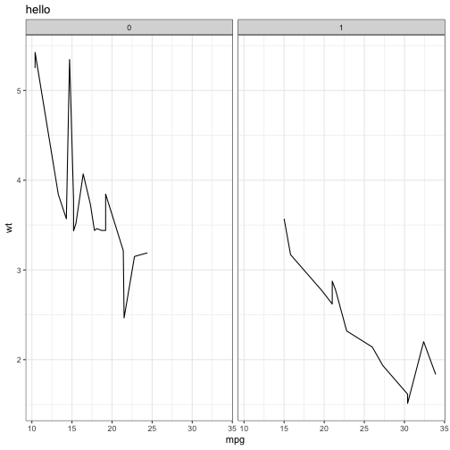

`ggplot2pipes`
==============================================================================


`ggplot2pipes` is a package for creating pipe-enabled versions of `ggplot2` functions.


Basic Usage
------------------------------------------------------------------------------

1. Call `init_ggplot2_pipes()` to create all the pipe-enabled functions
2. Use the new functions with dplyr/magrittr pipes


```r
library(dplyr)
library(ggplot2)
library(ggplot2pipes)

init_ggplot2_pipes()

ggplot(mtcars) %>%
  add_geom_line(aes(mpg, wt)) %>%
  add_labs(title="hello") %>%
  add_theme_bw() %>%
  add_facet_wrap(~am)
```




